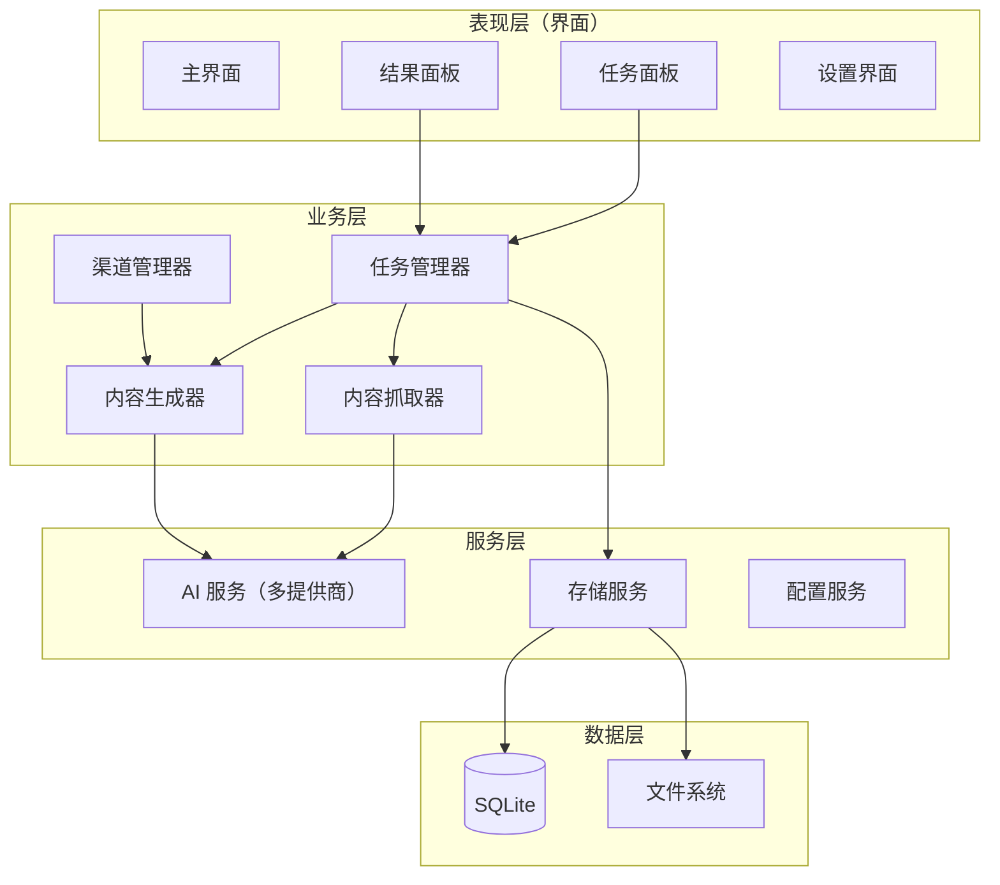

# ContentForge（内容锻造师）产品规划

> 版本：v0.2（与 HTML demo v0.1 同步）
> 日期：2026-09-02
> 状态：规划中，开发中

---

## 一、产品定位

**ContentForge（内容锻造师）** 是一款面向个人创作者的 **Windows 桌面工具**，核心能力是：

> 用户提供「文章链接 + 个人观点」，工具批量抓取原文、调用 AI，生成带有个人视角的、可直接发布的原创图文。

**一句话描述**：把别人的文章，锻造成你自己的内容。

**产品形态**：内容生成工作台。生文是第一个能力模块，后续将扩展生图、生视频能力；每个能力模块下按渠道细分（如「生文 → 微信公众号 / 头条号」）。界面导航与 API 配置从第一版起就按「能力 → 渠道」两级结构预留。

**目标用户**：
- 微信公众号运营者（个人号、小团队）
- 需要持续产出内容但精力有限的创作者
- 有素材积累、有个人观点，但写作/排版耗时的从业者

**核心价值**：
| 痛点 | 解决方案 |
| --- | --- |
| 找素材容易，写成文章难 | 链接自动抓取 + AI 融合观点生成成稿 |
| 一篇一篇写效率低 | 批量任务，一次提交多个链接，后台异步处理 |
| 不同平台格式调性不同 | 渠道绑定系统提示词，输出即符合平台风格 |

---

## 二、产品路线图

### Phase 1 — MVP（首个版本）

目标：跑通「链接 + 观点 → 微信公众号图文」完整闭环。

| 功能模块 | 功能描述 | 用户价值 |
| --- | --- | --- |
| 链接解析 | 输入文章 URL，自动抓取并解析文章内容 | 简化素材获取流程 |
| 观点输入 | 每个链接配一段个人观点（建议 100–500 字），可手动填写；支持「AI 生成观点」：系统抓取原文后一键生成 3–5 个候选观点，用户单选或多选，**每个选中的观点各生成一篇图文**（一个链接 × N 个观点 = N 个任务） | 保持原创性和个人风格；没思路时由 AI 辅助起步，一个素材可产出多篇不同角度的内容 |
| 批量任务 | 同时添加多个「链接 + 观点」，批量生成 | 提升效率，提交后无需等待 |
| 图文生成 | 基于原文 + 观点生成新的微信公众号图文 | 一键产出可直接发布的内容 |
| 渠道提示词 | 内置微信公众号风格系统提示词；菜单按「能力 → 渠道」两级组织，MVP 只上线微信公众号渠道 | 确保输出格式符合平台调性，后续渠道即插即用 |
| 结果管理 | 查看、编辑、复制、导出已生成的图文 | 方便后续发布和修改 |
| AI 配置 | 支持配置 AI 服务商（API Key、模型选择） | 用户可自选模型，成本可控 |

**MVP 验收标准**：
1. Windows 10/11 上可安装运行
2. 一次提交 5 个链接 + 观点，全部成功生成图文
3. 生成结果可直接复制到公众号编辑器使用

### Phase 2 — 增强版

| 功能模块 | 功能描述 |
| --- | --- |
| 多渠道支持 | 微博、小红书、知乎等平台适配（同一素材一键生成多渠道版本） |
| 提示词管理 | 用户自定义/编辑各渠道系统提示词，可导入导出 |
| 任务队列 | 可视化任务进度、暂停/取消/重试 |
| 历史记录 | 完整的生成历史记录、搜索、按渠道/日期筛选 |
| 导出功能 | 支持 Markdown、Word、图片等格式导出 |

### Phase 3 — 商业化

| 功能模块 | 功能描述 |
| --- | --- |
| 注册码系统 | 软件授权验证（离线激活优先） |
| 多用户管理 | 团队协作和权限控制 |
| 云端同步 | 跨设备数据同步（可选，保持本地优先） |
| 数据分析 | 内容生成量、使用频次等统计 |

---

## 三、用户使用流程（MVP）

```
1. 用户打开应用
2. 首次使用：在设置中配置 AI 服务商和 API Key
3. 点击「新增任务」
4. 输入文章链接，然后二选一：
   a. 手动填写个人看法/观点
   b. 点击「AI 生成观点」→ 系统抓取原文并生成 3–5 个候选观点 → 勾选一个或多个（每个观点将各生成一篇图文）
5. 重复添加多个任务（可选）
6. 点击「开始生成」
7. 系统后台批量处理：
   - 解析每个链接的文章内容
   - 调用 AI，结合系统提示词和任务对应观点生成新图文
8. 生成完成后，用户可查看、编辑、复制、导出结果
```

**AI 生成观点流程**：
```
输入链接 → 点击「AI 生成观点」
  → 系统抓取并解析原文（复用链接解析能力）
  → 调用 AI 基于原文生成 3–5 个不同角度的候选观点
  → 用户勾选 1 个或多个（也可不选，回到手动输入）
  → 每个选中观点自动拆分为独立任务（同链接、不同观点）
  → 批量生成时，每个任务各产出一篇图文
```

**典型场景**：用户早上收集了 5 篇行业文章，每篇写两三句观点，提交任务后去忙别的，回来时 5 篇图文草稿已生成完毕，逐篇微调后即可发布。

---

## 四、关键设计决策

1. **批量异步处理**：任务提交后进入后台队列处理，界面不阻塞，用户无需等待。
2. **渠道-提示词绑定**：每个渠道（如「图文-微信公众号」）绑定独立的系统提示词，生成时自动应用；架构上渠道即插件，方便扩展。
3. **本地优先**：任务数据、配置、历史记录全部存本地（SQLite），不上传云端，保护用户数据隐私，降低服务成本。
4. **AI 服务商可插拔**：抽象统一的 AI 服务接口，支持 OpenAI / Anthropic / 硅基流动等多提供商，用户通过配置切换，不锁定单一厂商。
5. **商业化预留**：架构上预留注册码校验入口，但 MVP 不实现。
6. **能力模块化导航**：界面导航按「能力（生文/生图/生视频）→ 渠道（微信公众号/头条号…）」两级组织。MVP 只实现「生文 → 微信公众号」，其余菜单位置全部预留（置灰 + 「即将上线」标识），用户从第一版就能看到产品全貌。
7. **API 配置按「能力 + 渠道」两级区分**：生文、生图、生视频各自独立配置 API Key、接口地址（base_url）、模型唯一标识（model_id）；同时支持渠道级覆盖（某个渠道可使用专属配置而非全局默认）。

## 五、界面导航与 API 配置设计（扩展预留）

### 导航结构（左侧导航栏）

```
内容锻造师 ContentForge
├── 📝 生文
│   ├── 微信公众号          ← MVP 首个上线
│   ├── 头条号              ← 菜单预留（置灰 / 「即将上线」）
│   └── 更多渠道…           ← 后续按需增加（知乎、小红书、百家号…）
├── 🖼️ 生图                 ← 菜单预留（置灰，Phase 2+）
├── 🎬 生视频               ← 菜单预留（置灰，Phase 2+）
├── 🕘 历史记录
└── ⚙️ 设置
    ├── API 配置            ← 生文/生图/生视频的模型配置
    ├── 渠道管理            ← 各渠道系统提示词查看/编辑
    └── 通用设置            ← 界面、数据目录、日志等
```

**设计要点**：
- 导航第一级是「能力」（生文/生图/生视频），第二级是「渠道」，与产品演进方向一致
- 未上线的能力/渠道在菜单中保留位置但置灰，并标注「即将上线」
- 新增渠道 = 注册一个渠道配置（提示词 + 可选专属 API 配置），无需改动导航代码

### API 配置设计

配置分**能力类型**（生文/生图/生视频）与**渠道**两级：

| 配置项 | 说明 | 示例 |
| --- | --- | --- |
| api_key | 服务商密钥 | `sk-xxxx` |
| base_url | 接口地址（凡兼容 OpenAI 协议的服务商均可填写） | `https://api.siliconflow.cn/v1` |
| model_id | 大模型唯一标识 | `Qwen/Qwen2.5-72B-Instruct` |

**配置规则**：
1. 每个能力类型有一套「全局默认配置」，该能力下所有渠道默认共用
2. 单个渠道可开启「专属配置」覆盖全局默认（例如头条号使用另一个模型/服务商）
3. 生图、生视频在 MVP 中只保留配置界面，不启用调用
4. 所有配置存储在本地，API Key 加密保存，不上传任何服务器

**配置数据结构（示意）**：

```yaml
api_config:
  text:                          # 生文
    default:                     # 全局默认
      base_url: https://api.xxx.com/v1
      api_key: sk-xxxx           # 加密存储
      model_id: Qwen/Qwen2.5-72B-Instruct
    overrides:                   # 渠道级覆盖（可选）
      toutiao:
        base_url: https://api.yyy.com/v1
        api_key: sk-yyyy
        model_id: glm-4-plus
  image:                         # 生图（预留）
    default: { base_url: "", api_key: "", model_id: "" }
  video:                         # 生视频（预留）
    default: { base_url: "", api_key: "", model_id: "" }
```

### 主界面布局

主界面采用「侧边导航 + 主内容区」布局：

| 区域 | 说明 |
| --- | --- |
| 左侧导航栏（232px） | 顶部 Logo + 产品名；按「能力 → 渠道」两级组织导航项；底部提示「本地运行·数据不出本机」 |
| 顶部栏（54px） | 面包屑路径（如「生文 / 微信公众号」）；右侧 API 状态指示 |
| 主内容区 | 页面内容，支持垂直滚动 |

**各页面内容**：

| 页面 | 核心内容 |
| --- | --- |
| 生文-微信公众号（MVP 主页面） | 新增任务表单 + 任务列表 + 底部「开始生成」按钮 |
| 历史记录 | 完整生成历史，支持搜索和按渠道筛选 |
| API 配置 | 生文/生图/生视频 三 Tab；全局默认配置 + 渠道专属配置开关 |
| 渠道管理 | 渠道列表 + 系统提示词查看/编辑入口 |
| 通用设置 | 数据目录、日志级别、开机自启等 |

**AI 生成观点交互流程（页面内）**：
1. 用户填入链接后，点击「✨ AI 生成观点」
2. 页面内展开候选观点面板，显示加载动画
3. 加载完成后展示 3–5 个候选观点（每个带视角标签，如「落地视角」「反驳视角」）
4. 用户点击卡片勾选/取消，可多选
5. 底部实时显示「已选 N 个观点（将生成 N 篇图文）」
6. 点「添加所选到任务列表」→ 每个选中观点各生成一条独立任务插入列表
7. 同时保留手动填写的入口（用户可回到手动输入模式）

**界面原型**：见 `docs/ui-demo.html`（HTML 静态演示稿，浏览器直接打开即可查看整体布局、导航结构与 API 配置交互）。

---

## 六、技术方案概要

### 技术选型

| 类别 | 选型 | 理由 |
| --- | --- | --- |
| 开发语言 | Python 3.11+ | 对 AI 生态友好，用户指定 |
| 桌面框架 | PyQt6 | 功能全面、界面美观、适合复杂应用 |
| 网络请求 | requests / httpx | 抓取网页内容 |
| HTML 解析 | BeautifulSoup4 + lxml | 提取正文，兼容微信/知乎等页面结构 |
| AI 接口 | openai SDK（兼容多数厂商 API） | 统一接口协议，切换服务商成本低 |
| 数据存储 | SQLite | 单文件数据库，本地优先，免安装 |
| 配置管理 | PyYAML + JSON | 提示词用 Markdown/YAML 管理，易读易改 |
| 日志 | loguru | 简洁强大，便于排查问题 |
| 打包 | PyInstaller | 打包为 Windows 可执行文件 |

### 项目目录结构

```
content-forge/                  # 产品根目录（所有资料都在这里）
├── docs/                       # 产品文档（全部中文）
│   ├── PLAN.md                 # 本文档：产品规划
│   ├── SPEC.md                 # 产品规格说明（开发前补充）
│   └── decisions/              # 技术决策记录
├── app/                        # 源代码
│   ├── main_window.py          # 主窗口
│   ├── ui/                     # 界面组件、样式
│   ├── core/                   # 任务管理、内容抓取、内容生成、渠道管理
│   ├── models/                 # 数据模型（任务、渠道）
│   ├── services/               # AI 服务、存储服务
│   └── utils/                  # 配置、日志
├── prompts/                    # 各渠道系统提示词（按能力/渠道两级组织）
│   ├── text/                   # 生文
│   │   ├── wechat.md           # 微信公众号提示词
│   │   └── toutiao.md          # 头条号提示词（预留）
│   ├── image/                  # 生图（预留）
│   └── video/                  # 生视频（预留）
├── data/                       # 本地数据目录（运行时生成，不入库）
├── tests/                      # 测试
├── main.py                     # 程序入口
├── requirements.txt
└── README.md                   # 使用说明（中文）
```

### 系统架构



### 核心模块职责

| 模块 | 职责 |
| --- | --- |
| 任务管理器（TaskManager） | 任务队列的增删改查、状态流转（待处理/处理中/已完成/失败）、事件驱动界面更新 |
| 内容抓取器（ContentFetcher） | URL 校验、网页抓取、正文提取与清洗、失败重试；优先适配微信公众号、知乎等主流平台 |
| 内容生成器（ContentGenerator） | 组装「系统提示词 + 用户观点 + 原文」调用 AI，返回生成结果，支持进度回调；并提供「候选观点生成」能力（基于原文生成 3–5 个不同角度的观点供用户勾选） |
| 渠道管理器（ChannelManager） | 渠道注册、提示词加载、渠道参数管理；新增渠道即新增一个提示词配置 |
| AI 服务（AIService） | 统一接口抽象，屏蔽不同厂商 API 差异 |

### 数据库设计（SQLite）

```sql
-- 任务表
CREATE TABLE tasks (
    id TEXT PRIMARY KEY,
    url TEXT NOT NULL,
    user_opinion TEXT NOT NULL,
    channel TEXT DEFAULT 'wechat',
    status TEXT DEFAULT 'pending',      -- pending / processing / completed / failed
    original_content TEXT,              -- 抓取到的原文
    generated_content TEXT,             -- 生成的图文
    error_message TEXT,
    created_at TIMESTAMP DEFAULT CURRENT_TIMESTAMP,
    updated_at TIMESTAMP DEFAULT CURRENT_TIMESTAMP,
    completed_at TIMESTAMP
);

-- 渠道表
CREATE TABLE channels (
    id TEXT PRIMARY KEY,
    name TEXT NOT NULL,                 -- 渠道标识，如 wechat
    display_name TEXT NOT NULL,         -- 显示名称，如「图文-微信公众号」
    system_prompt TEXT NOT NULL,        -- 系统提示词
    is_active INTEGER DEFAULT 1,
    created_at TIMESTAMP DEFAULT CURRENT_TIMESTAMP
);

-- 配置表
CREATE TABLE config (
    key TEXT PRIMARY KEY,
    value TEXT NOT NULL,
    updated_at TIMESTAMP DEFAULT CURRENT_TIMESTAMP
);
```

### 微信公众号系统提示词（内置初版）

```markdown
# 角色
你是一位资深的新媒体内容创作者，擅长基于原文内容，
融入个人观点和独特视角，创作出有深度、有态度的微信公众号文章。

# 能力
1. 深入理解原文核心观点和信息
2. 将用户的个人看法巧妙融入文章
3. 保持微信公众号的阅读风格和排版习惯
4. 标题吸引人，内容有干货

# 输出要求
1. 生成一篇 800–1500 字的微信公众号图文
2. 使用 Markdown 格式输出
3. 包含吸引人的标题
4. 适当使用 emoji 增加生动性
5. 段落长度适中，适合手机阅读
6. 突出用户个人观点，形成差异化内容
```

---

## 七、实施计划

| 阶段 | 周期 | 交付物 |
| --- | --- | --- |
| Phase 1.1 基础框架 | 1 周 | 项目结构、基础界面、配置管理、AI 服务接入 |
| Phase 1.2 核心功能 | 1–2 周 | 任务管理、内容抓取、图文生成、结果管理 |
| Phase 1.3 完善优化 | 1 周 | 界面优化、错误处理、打包发布 |

### 风险与应对

| 风险 | 应对 |
| --- | --- |
| 微信公众号等平台反爬，抓取失败 | 内置 UA 伪装与重试机制；抓取失败时允许用户手动粘贴原文兜底 |
| AI 生成质量不稳定 | 提示词持续调优；提供「重新生成」按钮 |
| 打包体积过大 | 依赖精简、按需打包，目标控制在 100MB 以内 |
| 各厂商 API 变动 | AI 服务层统一抽象，隔离变动影响 |

---

## 八、边界说明（MVP 不做的事）

- 不做自动发布到公众号（只生成内容，不碰平台发布接口，规避封号风险）
- 不做移动端 / macOS / Linux 版本
- 不做云端账号体系（仅本地数据）
- 不实现注册码（架构预留，功能不做）
